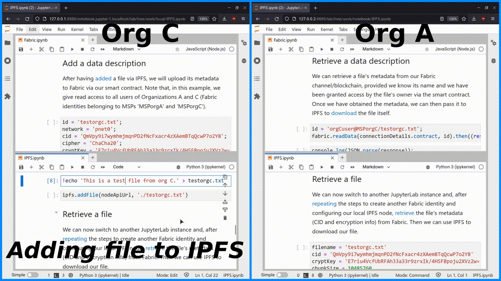

# Jovian Colab

Towards a [Jupyter](https://jupyter.org)-based Distributed Digital Object Sharing Platform using [IPFS](https://ipfs.io) and [Hyperledger Fabric](https://www.hyperledger.org/use/fabric) Blockchain.

**File Sharing Example:**  

**Contents:**  
 - docker: the virtual infrastructure (IPFS, Fabric, JupyterLab, and monitoring).
 - src: the applications' source code (IPFS client app, IPFS relay patch, Fabric gateway client app, Fabric CA client app, IPFS Smart Contract/Chaincode, Jupyter notebooks, and testing apps).
 - testing-results: the test measurements (data and plots).

Please refer to the README.md file(s) under the *docker* directory for more information.

Rik Janssen - [SNE/OS3](https://www.os3.nl)
