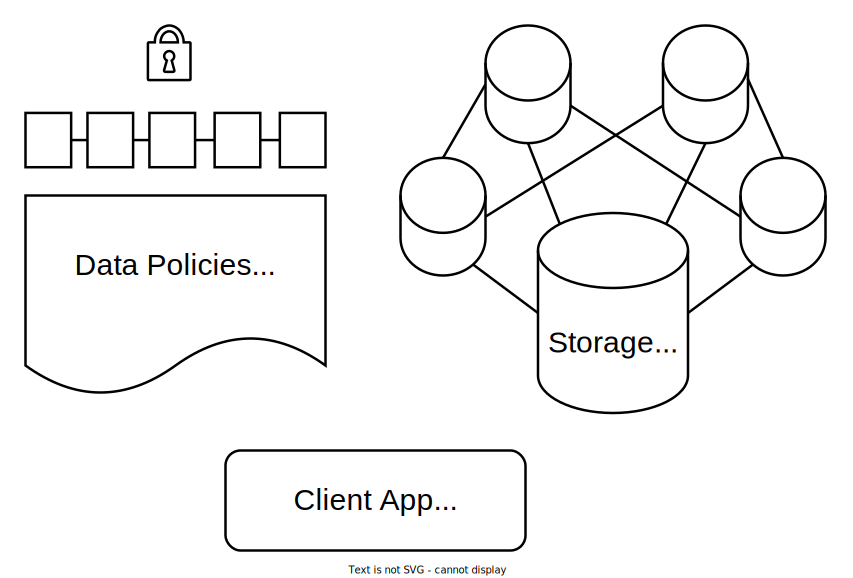

# jovian-colab
**Work in progress!**

Using *[JupyterLab](https://jupyter.org)* for decentralized file sharing via *[IPFS](https://ipfs.io)* and *[Hyperledger Fabric](https://www.hyperledger.org/use/fabric)*.

Please refer to the README.md file(s) under the *docker* directory for more information.

Rik Janssen - [SNE/OS3](https://www.os3.nl)
