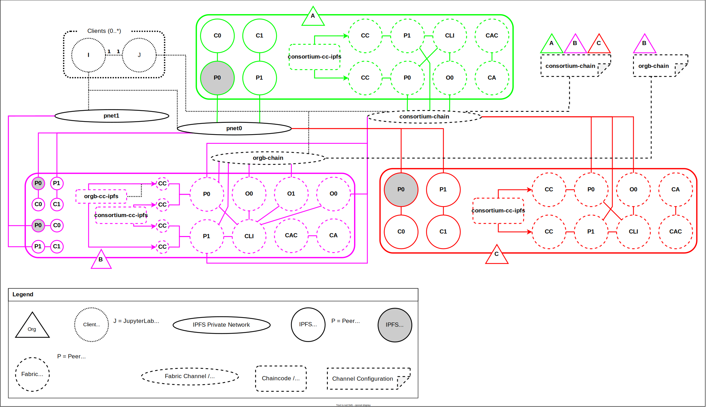

# Demo Infrastructure
Creates a virtual infrastructure, using *[Docker Compose](https://docs.docker.com/compose)*, that consists of *[JupyterLab](https://jupyter.org)*, *[IPFS](https://ipfs.io)* and *[Hyperledger Fabric](https://www.hyperledger.org/use/fabric)*. \
Note that Fabric and IPFS are only accessible from within the demo's network created by Docker Compose (i.e. we can't access the demo from the outside).
[Fablo](https://github.com/hyperledger-labs/fablo) (version 1.0.0) was used to generate the *initial* Hyperledger Fabric infrastructure configuration (we *heavily* modified this). \
Please see the '.env' file(s) for the configuration (e.g. which software version(s) to use, secret(s), etc.). Do *not* run multiple instances of this demo at the same time.

**SECURITY WARNING:** Do not expose this infrastructure directly to the Internet!

## Overview


The infrastructure consists of three organizations ('A', 'B', and 'C'), two Hyperledger Fabric blockchains/channels (one for the consortium and one for organization B), and two private IPFS networks (again, one for the consortium and one for organization B). The same chaincode/smart contract ('cc-ipfs') is deployed on both channels. The client application(s) consists of a JupyterLab Notebook and an IPFS peer.

## Requirements
The infrastructure consists of about 50 Docker containers.
 - Hardware: Tested on an x86_64 QEMU/KVM VM with a: 65 GiB virtual disk (SSD backend), 10 GiB RAM, 6 core CPU (Intel Xeon E3 1240L v5 backend).
 - Software: See tables below.

## Versions
The infrastructure consists of the software mentioned in the table below. We use Docker images for most of this software. Your user has to be a member of the 'docker' group. User namespaces / rootless containers and Podman are *not* supported.

| Software                                           | Version                                                                   |
| -------------------------------------------------- | ------------------------------------------------------------------------- |
| Ubuntu Server                                      | [20.04.4 LTS](https://releases.ubuntu.com/20.04/)                         |
| Docker                                             | [20.10.17](https://docs.docker.com/engine)                                |
| Docker Compose                                     | [2.6.1](https://docs.docker.com/compose)                                  |
| IPFS Peer                                          | [0.12.2](https://github.com/ipfs/go-ipfs/tree/v0.12.2)                    |
| IPFS Cluster                                       | [1.0.1](https://github.com/ipfs-cluster/ipfs-cluster/releases/tag/v1.0.1) |
| Hyperledger Fabric                                 | [2.4.5](https://hyperledger-fabric.readthedocs.io/en/release-2.4/)        |
| Fabric Client Node.js SDK (Legacy Application API) | [2.2.13](https://github.com/hyperledger/fabric-sdk-node/tree/v2.2.13)     |
| Fabric Chaincode Node.js SDK (Contract API)        | [2.4.2](https://github.com/hyperledger/fabric-chaincode-node/tree/v2.4.2) |
| Fabric Gateway Node.js SDK (Application API)       | [1.1.0](https://github.com/hyperledger/fabric-gateway/tree/v1.1.0)        |
| JupyterLab Notebook                                | [3.4.3](https://jupyterlab.readthedocs.io/en/3.4.x/)                      |
| Firefox                                            | [101.0.1](https://www.mozilla.org/en-US/firefox/101.0.1/releasenotes/)    |

### Node.js
| Fabric SDK                      | Node.js Version                                                                         |
| ------------------------------- | --------------------------------------------------------------------------------------- |
| Client (Legacy Application API) | [16](https://github.com/hyperledger/fabric-sdk-node/releases/tag/v2.2.12)               |
| Chaincode (Contract API)        | [16](https://github.com/hyperledger/fabric-chaincode-node/blob/v2.4.2/COMPATIBILITY.md) |
| Gateway (Application API)       | [16](https://github.com/hyperledger/fabric-gateway/releases/tag/v1.1.0)                 |

As per the [documentation](https://github.com/hyperledger/fabric/blob/8a4c7f3bdb17c18fe6c56ff7e3e2fc008e223005/docs/source/sdk_chaincode.md#fabric-contract-apis-and-application-apis), we use the client SDK (legacy) for CA administrative actions and the Gateway SDK as the actual client (i.e. JupyterLab).

## Internal Endpoints Overview
The following network sockets are used *within* the created virtual infrastructure (by the relevant containers). These endpoints are *not* reachable from the Docker host / outside.

| Component(s)                                                       | Endpoint |
| ------------------------------------------------------------------ | -------- |
| IPFS libp2p swarm                                                  | TCP 4001 |
| IPFS Peer RPC API (daemon/rw access, including Prometheus metrics) | TCP 5001 |
| IPFS Cluster HTTP REST API                                         | TCP 9094 |
| IPFS Pinning Services API                                          | TCP 9097 |
| IPFS Cluster swarm                                                 | TCP 9096 |
| IPFS Cluster Prometheus Metrics                                    | TCP 8888 |
| Fabric CA HTTP API                                                 | TCP 7054 |
| Fabric Orderer                                                     | TCP 7050 |
| Fabric Peer: listen and gossip                                     | TCP 7051 |
| Fabric Peer: chaincode listen                                      | TCP 7052 |
| Fabric Prometheus Metrics                                          | TCP 9443 |
| Node exporter Prometheus Metrics                                   | TCP 9100 |
| cAdvisor Web UI and metrics                                        | TCP 8080 |
| Prometheus Web UI and metrics                                      | TCP 9090 |
| Grafana Web UI                                                     | TCP 3000 |
| Hyperledger Explorer Web UI                                        | TCP 8080 |
| JupyterLab Notebook Web UIs (behind reverse proxy)                 | TCP 8888 |
| External/Second JupyterLab Notebook Web UI                         | TCP 8889 |

## Docker Host Network Bindings
The following network sockets are used on the Docker host machine (configured via the .env files). We use these network bindings to selectively expose the container endpoints (see above) to the Docker host machine.
 - IPFS peer APIs (IPFS Web UI access): 127.0.0.1:5000 - 127.0.0.1:5003
 - Organization A's endpoints to provide access to an external JupyterLab instance (via an SSH tunnel):
   - Fabric CA: 127.0.0.1:7054
   - Fabric Gateway: 127.0.0.1:7051
   - IPFS bootstrap node: 127.0.0.1:4001
 - Monitoring tools Web UIs: 127.0.0.1:7000 - 127.0.0.1:7004
 - JupyterLab Notebook local instances Web UI (via reverse proxy): 127.0.0.1:8888
 - JupyterLab Notebook external instance Web UI: 127.0.0.2:8889

## Possibly change UIDs and GIDs
Several directories will be mounted into the containers. You can specify your user ID and group ID via the .env files. This allows for data sharing between the containers and the Docker host.

## Optional: change the secrets in the .env file
**Generate IPFS cluster secret(s):**
```
echo "$(od -vN 32 -An -tx1 /dev/urandom | tr -d ' \n')"
```
**Generate IPFS swarm secret(s):**
```
go get github.com/Kubuxu/go-ipfs-swarm-key-gen/ipfs-swarm-key-gen
echo "$(ipfs-swarm-key-gen)"
```
Replace the newlines with '\n' (see the .env file for examples).

**NOTICE:** Please follow the steps below in the correct order (we use multiple Docker Compose files which create containers in the same network).

## Create Docker network
We manually create a Docker network that is used by the entire infrastructure (note that the network's name is referred to in each .env file used by Docker Compose).
```
docker network create jovian-colab_demo-net
```

## Boostrap IPFS
We need to provide bootstrap nodes for each private IPFS network.
1. Launch the IPFS bootstrap nodes and note their peer ID:
```
cd ./ipfs
./ipfs-docker.sh bootstrap
```

2. Add the bootstrap peer IDs in multiaddr format to the .env file (e.g. the multiaddr of organization A's peer0 for pnet0 is "/dns4/peer0.pnet0.orga.ipfs.localhost/tcp/4001/p2p/\<PEERID\>"). See the .env file for examples.

## Start IPFS
(Make sure you bootstrapped IPFS first.)
```
./ipfs-docker.sh up
```

## Start Fabric
```
cd ../fabric
./fabric-docker.sh up
```

## Start 3 (server local) JupyterLab (and IPFS node client) instances
```
cd ../jupyter
./jupyter-docker.sh up 3
```

## Access JupyterLab from your web browser
All instances are available via a reverse proxy:
 - [http://127.0.0.1:8888/notebook.jupyter-1.localhost](http://127.0.0.1:8888/notebook.jupyter-1.localhost)  
 - [http://127.0.0.1:8888/notebook.jupyter-2.localhost](http://127.0.0.1:8888/notebook.jupyter-2.localhost)  
 - [http://127.0.0.1:8888/notebook.jupyter-3.localhost](http://127.0.0.1:8888/notebook.jupyter-3.localhost)  

### Optional: access the JupyterLab instances via remote using an SSH tunnel (i.e. if you are not running Docker on your local system)
```
ssh <user>@<dockerhost> -L 127.0.0.1:8888:127.0.0.1:8888
```

## Access Fabric and IPFS via JupyterLab
Now that we have a running infrastructure, we combine two Jupyter notebooks to serve as our client applications. One notebook handles our interaction with IPFS and another notebook handles our interaction with Fabric.

We require several prerequisites for these notebooks to work: Node.js and IJavascript have to be installed; the client modules have to be build and installed; and the notebooks and configuration file have to copied from our Git repository's *'src/jupyter/notebook'* directory into the containers. We have automated these steps by modifying the JupyterLab container image.

Both notebooks are available in the *'/home/jovyan/work/local'* directory of each JupyterLab instance. Proceed with the Fabric notebook in the first JupyterLab instance to continue this demo. **NOTE:** Any changes to the notebooks will be *temporarily* preserved (i.e. we are mounting the host's *'./docker/jupyter/jupyter-data/notebook/<instance>* directory inside of the container, but we remove this directory when the demo is stopped).

## Optional: Start an external JupyterLab (and an IPFS node client)
The JupypterLab instances above run on the same server and have direct access to Fabric and IPFS (all containers are part of the same network). We can add another JupyterLab instance that's running on our local system and that connects to organization A.

Set up an SSH tunnel (to access Fabric CA, Fabric Gatway, and the IPFS bootstrap node):
```
ssh <user>@<dockerhost> -L 172.17.0.1:7054:127.0.0.1:7054 172.17.0.1:7051:127.0.0.1:7051 172.17.0.1:4001:127.0.0.1:4001
```
Note that this SSH tunnel connects to the IP address of the local Docker default bridge (172.17.0.1). This interface is accessible from *within* the containers.

Now clone this Git repository to your local system and copy the crypto material to the *'docker/jupyter-external/jupyter-data/server-crypto-config'* directory (i.e. copy the server's *'docker/fabric/fabric-config/crypto-config'* directory to your local system's *'server-crypto-config'* directory).

Launch JupyterLab and its local IPFS node and then proceed with the Fabric notebook. **NOTE:** The notebooks are available in the *'/home/jovyan/work/notebooks'* directory and any changes to the notebooks *will* be preserved (i.e. we are mounting the host's *'./src/jupyter/notebook'* directory inside of the container).
```
cd jupyter-external
./jupyter-docker-ext.sh up
```

### Access JupyterLab from your web browser
Note that we are using 127.0.0.2:8889 as to prevent a possible port and session cookie collision when using the SSH tunnel above to access the Jupyterlab instances that are running on the server.
[http://127.0.0.2:8889](http://127.0.0.2:8889)

## Testing blockchain/channel access
We utilize Fabric's [Access Control Lists (ACLs) and policies](https://hyperledger-fabric.readthedocs.io/en/release-2.4/access_control.html) to limit access from the client SDK to the blockchaiigncertsn/channel. Specifically, we don *not* allow non-admins to subscribe to block events, which allows for full read access to all data/blocks, and thereby bypass our chaincode (which implements its own ACLs). We can verify a user's access level as follows:
```
(From within the src directory.)
cd ./fabric/acl-policy-test
./test.sh
```
Note that this test application uses the legacy client API and not the newer gateway API. Consequently, we have to use the older wallet identity files (instead of the key-pair files directly). Also note that there is a difference between admin users. I.e. the Fabric CA admin is *not* the same as the MSP's admin identity, and we need the MSP's. E.g. the crypto material of organization A's admin identity can be found in the sub-directories 'keystore' and 'signcerts' of the *'./docker/fabric/fabric-config/crypto-config/peerOrganizations/orga.fabric.localhost/users/orgadmin@orga.fabric.localhost/msp'* directory. A user's crypto material can be obtained via the enrollment process that is mentioned in Fabric's Jupyter notebook.

## Verify that Docker is running
```
docker --help
docker info
docker images | less -S
docker ps | less -S
docker network ls
docker network inspect jovian-colab_demo-net
```

## Verify that IPFS is running
**IPFS node/peer CLI examples:**
```
docker exec peer0.pnet0.orga.ipfs.localhost ipfs --help
docker exec peer0.pnet0.orga.ipfs.localhost ipfs id
docker exec peer0.pnet0.orga.ipfs.localhost ipfs bootstrap list
docker exec peer0.pnet0.orga.ipfs.localhost ipfs swarm peers
```
**IPFS cluster CLI examples:**
```
docker exec cluster0.pnet0.orga.ipfs.localhost ipfs-cluster-ctl --help
docker exec cluster0.pnet0.orga.ipfs.localhost ipfs-cluster-ctl peers ls
```

## Verify that Fabric is running
**CLI examples:**
```
docker exec cli.orgb.fabric.localhost peer --help
docker exec cli.orgb.fabric.localhost peer channel list
./fabric-docker.sh channel getinfo orgb-chain orgb peer0
```

## Monitoring
See the README.md file in the 'monitoring' directory.

## Troubleshooting
You can create a Ubuntu-based container to troubleshoot the infrastructure (i.e. to install tools and access all the endpoints from *within* the same virtual network).
```
docker run -it --rm --name troubleshoot --network jovian-colab_demo-net ubuntu:focal bash
cd ~
apt update && apt upgrade -y && apt install -y curl less
```

## Stop/Cleanup the demo
(From within the docker directory.)
```
cd ./jupyter
./jupyter-docker.sh down
cd ../fabric
./fabric-docker.sh down
cd ../ipfs
./ipfs-docker.sh down
docker network rm jovian-colab_demo-net
```

## Possibly remove the created Docker volumes
The demo can use up to several GBs of Docker volumes, delete them if needed. **WARNING**: The below command will delete *all* your Docker volumes!
```
docker volume prune
```
