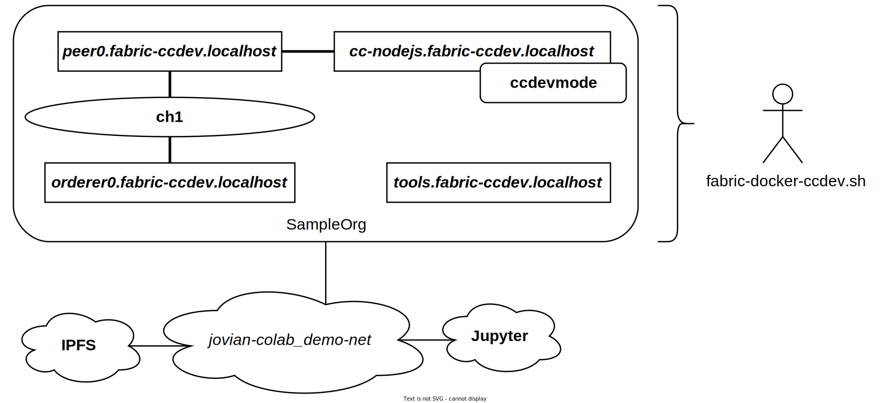

# Demo Infrastructure - Dev Mode
Creates a Hyperledger Fabric infrastructure running in *[development mode](https://github.com/hyperledger/fabric/blob/df388228156b882e07795a9041c0dde754f6e745/docs/source/peer-chaincode-devmode.md#running-chaincode-in-development-mode)* for rapid smart contract development. Note that the scripts used within this directory are depending on the '../fabric' directory. We also need to first start the IPFS infrastructure (this creates the needed network).

Please see the '.env' file(s) for the configuration (e.g. which software version(s) to use, secret(s), etc.). Do *not* run multiple instances of this demo at the same time.

**SECURITY WARNING:** Do not expose this infrastructure directly to the Internet! TLS is disabled and the generated crypto material is optional.

## Overview


The Fabric infrastructure is connected to the same network as the IPFS and Jupyter infrastructure. The Fabric infrastructure consists of one organization 'SampleOrg'. Within this organization one peer and one orderer node are deployed that have joined a single channel named 'ch1'. The chaincode 'ccdevmode' is deployed on the channel, using its own container via the peer node. A tools container is used to create the channel. We can manage this Fabric development environment using the 'fabric-docker-ccdev.sh' script (see below).

## Possibly change UID and GID
The chaincode directory and fabric-config directory will be mounted into the containers. You can specify your user ID and group ID via the .env file. This gives the containers the needed write access on the Docker host.

## Start the infrastructure (first start the IPFS infra)
```
./fabric-docker-ccdev.sh up
```

## Build the chaincode (i.e. install the Node.js modules), start it, and approve/commit it (only needed once)
The chaincode gets deployed as 'ccdevmode', version 0.1, on channel 'ch1'. Changes to the code will *not* result in a name change.
```
./fabric-docker-ccdev.sh build [chaincode directory]
./fabric-docker-ccdev.sh start [chaincode directory]
./fabric-docker-ccdev.sh commit
```

## Invoke the chaincode
```
./fabric-docker-ccdev.sh invoke [invoke args] [chaincode directory]
```

## Rebuild the chaincode (this will re-create the chaincode container with the changes)
```
./fabric-docker-ccdev.sh rebuild [chaincode directory]
```

## Cleanup the infrastructure
```
./fabric-docker-ccdev.sh down
```

## Possibly remove the created Docker volumes
**WARNING**: The below command will delete *all* your Docker volumes!
```
docker volume prune
```
