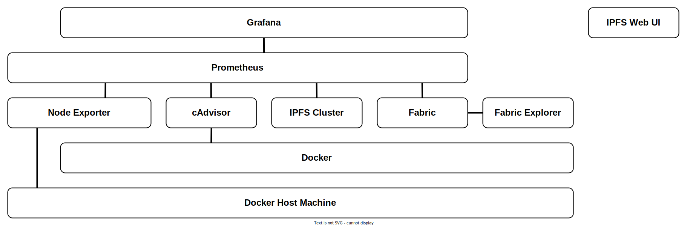

# Demo Infrastructure - Monitoring
Creates a monitoring infrastructure. We gather metrics (using Prometheus) from the IPFS and Fabric applications, and the underlying Docker containers (using cAdvisor) and host machine (using Node exporter). We then visualize these metrics (using Grafana). In addition, we also look at the IPFS and Fabric container output (using logspout), and the blockchain(s) (using Hyperledger Explorer).

See the '.env' file for the configuration (e.g. which software version(s) to use, sockets, etc.). Do *not* run multiple instances of this infra at the same time.

**SECURITY WARNING:** Do not expose this infrastructure directly to the Internet! The monitoring traffic is *not* encrypted!

## Overview


## Monitor IPFS & Fabric container terminal ouput using [Logspout](https://github.com/gliderlabs/logspout)
If we *only* want to monitor the output of the IPFS and Fabric containers, we can use the script below instead of the entire monitoring infrastructure.
```
./monitordocker.sh
```
The script will start a logspout container and access its published socket (default: <http://127.0.0.1:7000>).

## Start the monitoring infrastructure (first start IPFS and Fabric)
```
docker-compose up -d
```

## Monitoring Tools
| Tool                                                                  | Web UI URL                         |
| --------------------------------------------------------------------- | ---------------------------------- |
| [cAdvisor](https://github.com/google/cadvisor)                        | <http://127.0.0.1:7001>            |
| [Prometheus](https://prometheus.io)                                   | <http://127.0.0.1:7002>            |
| [Grafana](https://grafana.com)                                        | <http://127.0.0.1:7003/dashboards> |
| [Hyperledger Explorer](https://wiki.hyperledger.org/display/explorer) | <http://127.0.0.1:7004>            |
| [IPFS Web UI](https://github.com/ipfs/ipfs-webui)                     | <https://webui.ipfs.io>            |

## Grafana Dashboards Web UI
We provisioned Grafana dashboards for IPFS, Fabric, Docker, and the Docker host machine. The username and password for Grafana is admin/admin.

## Hyperledger Explorer Web UI
We can use Hyperledger Explorer to visualize the blockchain(s) (e.g. view blocks, transactions and associated data). Note that Hyperledger Explorer is in beta and might show some incorrect information (e.g. it doesn't show the different networks for different channels or the correct chaincode(s) per channel).

## IPFS Web UI
IPFS's web UI] is *not* included within IPFS's Docker image because it's downloaded on first usage by IPFS using the public global IPFS network. As such, the web UI is not available by default when using a *private network*. Since the latest version is also hosted at [webui.ipfs.io](https://webui.ipfs.io), we can utilize it instead. Note that this requires [exposing the IPFS peers' API socket and allowing cross-origin (CORS) requests](https://github.com/ipfs/ipfs-webui/tree/v2.13.0#configure-ipfs-api-cors-headers), for example:
```
docker exec peer1.pnet0.orga.ipfs.localhost ipfs config --json API.HTTPHeaders.Access-Control-Allow-Origin '["http://localhost:3000", "https://webui.ipfs.io", "http://127.0.0.1:5001"]'
docker exec peer1.pnet0.orga.ipfs.localhost ipfs config --json API.HTTPHeaders.Access-Control-Allow-Methods '["GET", "POST"]'
docker restart peer1.pnet0.orga.ipfs.localhost
```

## Optional: access the Web UIs via remote using an SSH tunnel (i.e. if you are not running Docker on your local system)
```
ssh <user>@<dockerhost> -L 127.0.0.1:7001:127.0.0.1:7001 -L 127.0.0.1:7002:127.0.0.1:7002 -L 127.0.0.1:7003:127.0.0.1:7003 -L 127.0.0.1:7004:127.0.0.1:7004
```

## Cleanup
```
docker-compose down
docker kill jc_demo_logspout
docker rm jc_demo_logspout
```

## Possibly remove the created Docker volumes
**WARNING**: The below command will delete *all* your Docker volumes!
```
docker volume prune
```
